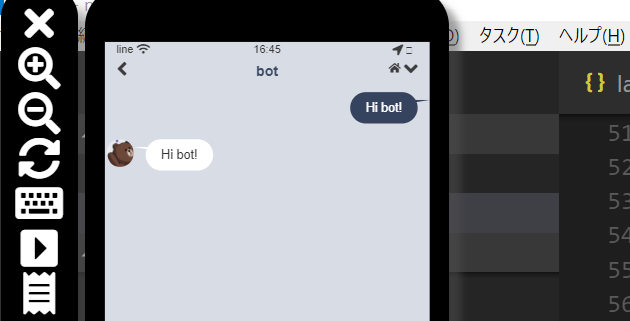
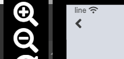

# LINE Simulator for BOT developer
Are you getting tired using physical device for debug your LINE bot? Yes I am! This project contains simulator to boost your developer productivity.

## Prerequisits
- LINE developer account
- node.js
- And of course your LINE bot app :)
- **This app is only tested in Chrome**
## Simulator setup
```
git clone https://github.com/kenakamu/LINESimulator
npm install
npm start
```
If you are using MacOS, open a browser and connect to http://localhost:8080. 

# How this works
This app works as LINE client simnulator, as well as LINE Platform simulator. All the request from your bot application shall come to this simulator, and it will redirect to LINE platform if necessary, otherwise it just returns the message to simulator UI.

## How to specify the simulator URL for bot application
1. Follow the setup to run the simulator. By default it uses port 8080. If you dont' like it, change it in the source code.
1. In your bot app, specify http://localhost:8080 as your LINE URL. This varies depending on which SDK you are using.

**C#**: Pass the URL for LineMessagingClient constructor.
```csharp
var lineMessagingClient = new LineMessagingClient(accessToken, "http://localhost:8080");
``` 
**Golang**: Pass the URL for linebot.New
```go
bot, err := linebot.New(
		channelSecret,
		channelToken,
		"http://localhost:8080"
	)
```
**python**: Pass the URL for linebot.LineBotApi constructor. 
```python
line_bot_api = LineBotApi(channel_access_token, "http://localhost:8080")
```
**Node.js**: for node.js it is slightly different. Specify the URL with /bot at the end for process.env.API_BASE_URL. You can do so in config or write it in the code, but you need to do so before you loda @line/bot-sdk module.
```javascript
process.env.API_BASE_URL = "http://localhost:8080/bot";
const line = require('@line/bot-sdk');
```

## How to use the simulator.
1. Open Chrome and connect to http://localhost:8080
1. You will see the connection page. Enter your Bot API URL, user id, channel secret and token, then click "connect".<br/>
1. In the chat bar, enter any text and hit "Enter" or click send icon.<br/>
1. Depending on your implementaion, you can see reply.<br/>

## Update settings
1. Simply click gear icon.
1. Change settings and click connect.

You can also specify any LINE user so this is useful to test with other user.

## Zoom
1. Click zoomin or zoomout in menu.<br/>
1. Confirm the only simulator zoomin/out.

When you need to zoom entire page, simply use browser zoom feature.

## Keyboard
You can simulate how keyboard hides the chat window.
1. Click keyboard icon either in chatbar or in menu.<br/>
1. You see keyboard is appearing in the chat. You cannot type via keyboard as this is just an image.<br/>

## Send non-text
1. Click "Right arrow" icon either in chatbar or in menu.<br/>
1. Use the more menu area to send any non-text data. You can send image, sticker, location or system messages. <br/>

## See the JSON object
1. Select any sent or replied area.
1. You see JSON object.<br/>
1. Click close icon to close it.

# Features
At the moment, the simulator can:
- Send text, image, location, sticker, system events.
- Display text
- Display image/video
- Display buttons, confirm, carousel templates
- Handle actions from templates

## Change the simulator size
At the moment, you need to manually change the size. Just simply modify the value of css variables in public/css/site.css.
## Feature to be added
- Datetime Picker
- URL actions
- Rich menus
- Simulator choice such as iPhone X/iPhone 8/Xperia XZ1 etc.
